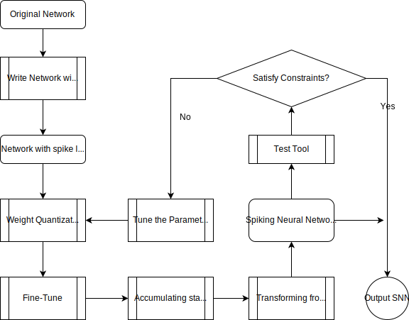

# ANN to SNN tool

This is a tool for transferring ANN to SNN.
It supports low-precision quantization of network weights.
The tool supports the networks with convolution layer,
linear layer and average pooling layer.

## Requirements
* Python >=3.5
* pytorch >=1.3
* torchvision
* GPUtil

## Constraints
For Hardware v1.0, the input channel size of the convolution
in the network
must meet the following constraints.
* 3x3 kernel
  * 1bit in_channels<=113
  * 2bit in_channels<=56
  * 3bit in_channels<=37
  * 4bit in_channels<=28
* 5x5 kernel
  * 1bit in_channels<=40
  * 2bit in_channels<=20
  * 3bit in_channels<=13
  * 4bit in_channels<=10

The convolutional layers in the ANN must
take the ReLU activations function after it.

The final Fully connect layer and softmax layer will
not be transformed.

## Transform process
The overall transform process is demonstrated in the following picture

<div align=center>


</div>

There is a example at transform_example.py.

```shell
$ python3 transform_example.py --weight_bitwidth 4 --timesteps 64 --finetune_epochs 30 --load checkpoint/example_net_ann.pth
```

You can transform your own network by changing the ExampleNet in this python file.
The arguments here are:
* --load LOAD
                        the location of the trained weights
*  --dataset DATASET     the location of the trained weights
*  --save_file SAVE_FILE
                        the output location of the transferred weights
*   --batch_size BATCH_SIZE
*   --test_batch_size TEST_BATCH_SIZE
*   --timesteps TIMESTEPS
*   --reset_mode {zero,subtraction}
*   --weight_bitwidth WEIGHT_BITWIDTH
                        weight quantization bitwidth
*   --finetune_lr FINETUNE_LR
                        finetune learning rate
*   --finetune_epochs FINETUNE_EPOCHS
                        finetune epochs
*   --finetune_wd FINETUNE_WD
                        finetune weight decay
*   --finetune_momentum FINETUNE_MOMENTUM
                        finetune momentum


### dataset
The datasets.py contains the dataloader for MNIST and CIFAR10/100.

If other dataset is used,
the corresponding dataloader should be defined in the datasets.py

### Write network definition
Write your network class use the following modules:
* SpikeReLU
* SpikeConv2d,SpikeLinear
* SpikeAvgPool2d,spike_avg_pooling

This is the example network in transform_example.py:
```pytho3
class ExampleNet(nn.Module):
    def __init__(self):
        super().__init__()
        # SpikeConv2d can be Conv2d in
        self.conv1 = SpikeConv2d(3, 8, 5, bias=False)
        self.relu1=SpikeReLU()
        self.conv2 = SpikeConv2d(8, 16, 3, bias=False)
        self.relu2 = SpikeReLU()
        self.conv3 = SpikeConv2d(16, 32, 3, bias=False)
        self.relu3 = SpikeReLU()
        self.fc1 = SpikeLinear(4*4*32, 10, bias=False)

    def forward(self, x):
        out = self.relu1(self.conv1(x))
        out = spike_avg_pooling(out, 2)
        out = self.relu2(self.conv2(out))
        out = spike_avg_pooling(out, 2)
        out = self.relu3(self.conv3(out))
        out = out.view(out.size(0), -1)
        out = self.fc1(out)
        return out
```


### Weight quantization
The weight quantization module is located in quantization.py.
You can use the `quantization.quantize_finetune` to quantize and finetune the network.

```python3
qnet=quantize_finetune(raw_net,trainloader,criterion,device,args)
```

The quantized network is returned, then we can test its (ANN) accuracy
by using the validate_ann in validate.py module.

```python3
qnet_top1,qnet_loss=validate_ann(qnet,test_loader,device,criterion)
```

### Transform quantized ANN to SNN
The transformation module is located in ann2snn.py.
You can use the `ann2snn.trans_ann2snn` to transform the quantized network.

```python3
snn=trans_ann2snn(qnet,train_val_loader,device,args.timesteps,args.weight_bitwidth)
```

The SNN network is returned, then we can test its (SNN) accuracy
by using the validate_snn in validate.py module.

```python3
snn_top1,snn_loss=validate_snn(snn,test_loader,device,criterion,args.timesteps)
```

### Save the SNN
Finally, the SNN can be saved in the `.pth` file.
```python3
torch.save(snn,args.save_file)
print("Save the SNN in {}".format(args.save_file))
```

# Error Analysis

There is a tool for analyse the error of quantization and spike transform.

### Requirement
* seaborn
* matplotlib

### Usage
As a example, we analyse the example_net as follows:
```shell
$ python3 analyse_error.py --load checkpoint/example_net_ann.pth example_net --finetune_epochs 10
```
