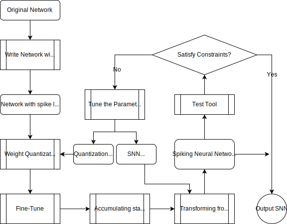

# ANN to SNN tool

This is a tool for transferring ANN to SNN.
It supports low-precision quantization of network weights.
The tool supports the networks with convolution layer,
linear layer and average pooling layer.

## Requirements
* Python >=3.5
* pytorch >=1.3
* GPUtil
* matplotlib

## Constraints
For Hardware v1.0, the input channel size of the convolution
in the network
must meet the following constraints.
* 3x3 kernel
  * 1bit in_channels<=113
  * 2bit in_channels<=56
  * 3bit in_channels<=37
  * 4bit in_channels<=28
* 5x5 kernel
  * 1bit in_channels<=40
  * 2bit in_channels<=20
  * 3bit in_channels<=13
  * 4bit in_channels<=10

The convolutional layers in the ANN must
take the ReLU activations function after it.

The final Fully connect layer and softmax layer will
not be transformed.

## Transform process

### Preparing data
The data loader should be defined in the datasets.py

